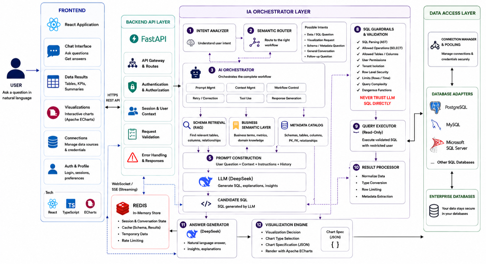
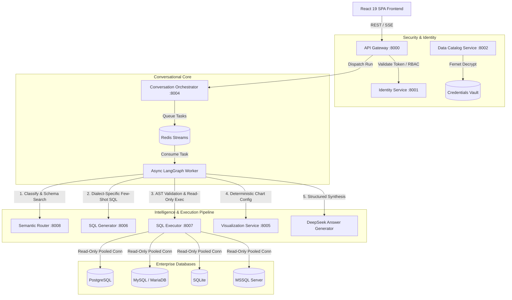

# ASK YOUR DATA — Conversational AI Platform for Enterprise Databases



Ask Your Data is a conversational Business Intelligence platform that lets authorized users explore enterprise data with natural language. It combines a React frontend, FastAPI services, LangGraph orchestration, secure SQL validation, database adapters, and interactive ECharts visualizations.

## Project Status

The repository is an active engineering project. PostgreSQL, MySQL/MariaDB, and SQLite workflows are implemented and covered by automated tests. The Microsoft SQL Server adapter is experimental until it is validated against the target SQL Server driver and deployment environment. Production deployments require external secrets, a configured LLM provider, and read-only credentials for each connected data source.

[](https://github.com/hamza-bouda/ask_your_data/actions/workflows/ci.yml)
[](https://fastapi.tiangolo.com)
[](https://react.dev)
[](https://langchain-ai.github.io/langgraph/)
[](https://platform.deepseek.com)

**ASK YOUR DATA** is a Conversational Business Intelligence (BI) platform that transforms natural language questions into secure, validated SQL queries across PostgreSQL, MySQL/MariaDB and SQLite. A Microsoft SQL Server adapter is included as an experimental integration and must be validated against the target SQL Server driver/environment before production use.

---

## Architecture Overview

The platform is designed following a decoupled, event-driven microservices architecture:



---

## Key Capabilities and Security Guardrails

1. **Multi-DBMS Support with Dialect Introspection**:
   - Native adapters for PostgreSQL, MySQL/MariaDB, SQLite, plus an experimental Microsoft SQL Server adapter.
   - Dynamic schema introspection (tables, columns, primary/foreign keys, types, nullability).
2. **DeepSeek-First AI Pipeline with Graceful Fallback**:
   - DeepSeek V3 chat model (`deepseek-chat`) default for high-precision SQL and executive summaries.
   - Deterministic offline fallbacks keep local/test workflows usable when an LLM provider is unavailable; production still requires a configured provider key for LLM-generated SQL and synthesis.
3. **Multi-Layer SQL Security Guardrails**:
   - **AST-Level SQL Parser (`sqlglot`)**: Enforces `SELECT`-only execution.
   - **Prohibited Syntax**: Automatic rejection of `INSERT`, `UPDATE`, `DELETE`, `DROP`, `ALTER`, `CREATE`, `TRUNCATE`, `GRANT`, stacked queries (`;`), and `SELECT *`.
   - **System Functions Blacklist**: Blocks `pg_read_file`, `xp_cmdshell`, `sys_eval`, `openrowset`, `sleep`, etc.
   - **Strict Allowlist & Column Masking**: Queries can only reference admin-approved tables and columns.
   - **Injected Execution Bounds**: Automatic enforcement of `LIMIT` ceilings and read-only transaction parameters.
4. **Tenant Isolation & Zero Trust**:
   - Database credentials encrypted at rest using AES-128-CBC via Fernet (`FERNET_KEY`).
   - Dynamic per-tenant connection pooling with automated cache invalidation.
   - Strict RBAC with `admin`, `analyst`, and `viewer` roles.
5. **Real-time Streaming & Interactive UI**:
   - Server-Sent Events (SSE) stream pipeline execution stages, SQL drafts, and data in real-time.
   - Rich interactive dashboards with drag-and-drop customization (`@dnd-kit`) and Apache ECharts.

---

## Quickstart with Docker Compose

### Configure the Environment
Copy the example environment file and configure keys:
```bash
cp .env.example .env
```

Generate a secure 32-byte base64 Fernet key:
```bash
python -c "from cryptography.fernet import Fernet; print(Fernet.generate_key().decode())"
```
Place the generated key in `.env` under `FERNET_KEY`.

### Launch the Full Stack
```bash
docker compose -f infra/compose/docker-compose.yml up -d --build
```

Access the applications:
- **Web Application (UI)**: [http://localhost](http://localhost) when using Docker Compose, or [http://localhost:5173](http://localhost:5173) with the Vite development server
- **API Gateway**: [http://localhost:8000](http://localhost:8000)
- **Interactive API Docs (Swagger)**: [http://localhost:8000/docs](http://localhost:8000/docs)
- **Prometheus Metrics**: [http://localhost:9090](http://localhost:9090)
- **Jaeger Tracing**: [http://localhost:16686](http://localhost:16686)

---

## Testing and Verification

The repository contains extensive unit, contract, security, integration, and E2E regression test suites:

### Run Full Test Suite
```bash
# Python Backend Test Suite (see the CI summary for the exact count)
python -m pytest -v -m "not integration"

# Specific Service Tests
python -m pytest tests/adapters/ -v
python -m pytest tests/security/ -v
python -m pytest tests/gateway/ -v
python -m pytest tests/orchestrator/ -v
python -m pytest tests/sql_executor/ -v
python -m pytest tests/sql_generator/ -v
python -m pytest tests/semantic_router/ -v
python -m pytest tests/identity/ -v
python -m pytest tests/catalog/ -v

# Frontend Vitest Suite & Build
cd frontend
npm test
npm run build
```

---

## Repository Structure

```
ask_your_data/
├── backend/
│   └── services/
│       ├── gateway/           # Public entrypoint, authentication proxy, rate limiter, SSE
│       ├── identity/          # Multi-tenant JWT auth, RBAC policy store & audit
│       ├── catalog/           # Data source registration, schema introspection & policy allowlist
│       ├── orchestrator/      # LangGraph state machine, Redis stream worker, dashboards & export
│       ├── semantic_router/   # Query intent classification & schema discovery
│       ├── sql_generator/     # Multi-dialect few-shot SQL generator & self-repair loop
│       ├── sql_executor/      # AST safety validation, connection pool & read-only execution
│       └── visualization/     # Deterministic chart specification engine
├── frontend/                  # React 19 + Vite frontend (Tailwind-free vanilla styling, ECharts, DnD)
├── packages/
│   ├── contracts/             # Shared Pydantic data schemas, LLM provider abstraction, and API contracts
│   └── observability/         # OpenTelemetry tracing, Prometheus metrics, and structured logging
├── infra/
│   └── compose/               # Production and development Docker Compose configurations
├── tests/                     # Automated test suites for all services, security, adapters, and E2E
├── docs/                      # SRE runbooks, operational guides, and architecture specifications
└── .github/workflows/         # Multi-matrix CI/CD pipeline
```

---

## License and Compliance

Licensed under the MIT License. Designed strictly for read-only analytical database access without data mutation privileges.
